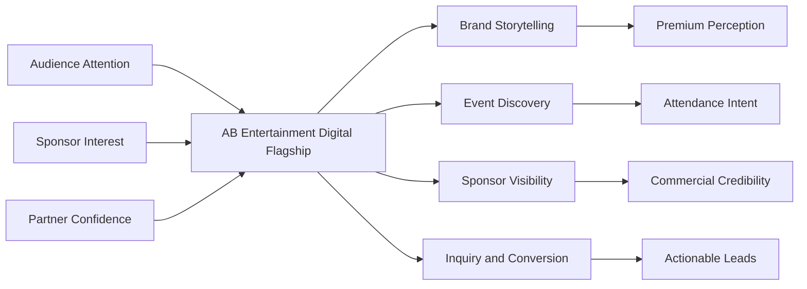
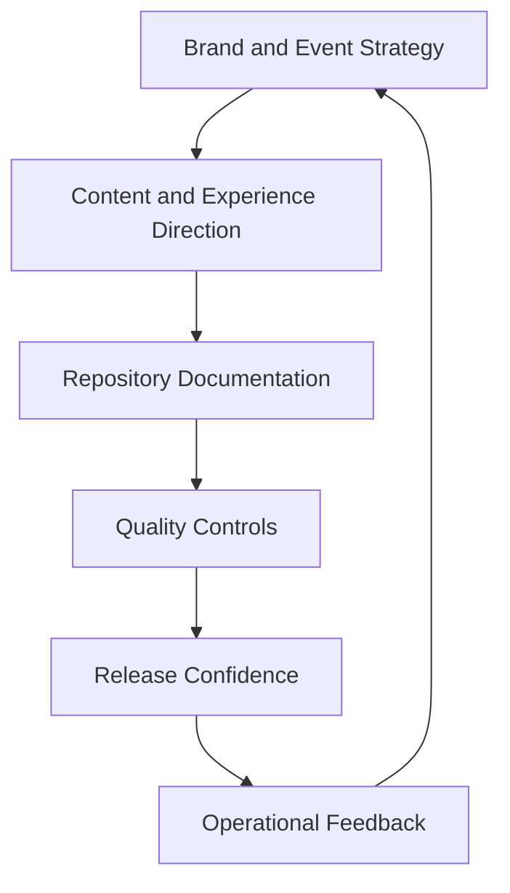
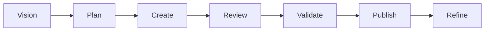

# AB Entertainment

AB Entertainment is the digital program for a premium live events brand serving Indian and Marathi cultural audiences across Australia and New Zealand. This repository is intended to present the initiative with the same discipline, clarity, and polish expected from a high-trust executive-facing platform.

## Executive Overview

The objective is straightforward: build and maintain a digital flagship that reflects the quality of the on-stage experience. The repository should communicate strategic intent, support disciplined delivery, and make future implementation decisions easier to evaluate.

### Executive Snapshot

| Dimension | Standard |
| :--- | :--- |
| Positioning | Premium cultural event and audience experience platform |
| Primary Users | Attendees, sponsors, partners, internal operators |
| Repository Role | Project narrative, delivery assets, quality controls |
| Operating Principles | Clarity, trust, elegance, performance, accessibility |
| Quality Bias | High-signal documentation and concise automation |

## Strategic Priorities

| Priority | Why It Matters | Repository Expectation |
| :--- | :--- | :--- |
| Brand Elevation | The digital experience must feel as refined as the live event brand. | Documentation and presentation should be polished, restrained, and credible. |
| Commercial Readiness | Event discovery, sponsor confidence, and conversion paths must feel deliberate. | Project materials should explain value, operating model, and governance clearly. |
| Operational Discipline | Premium positioning fails without consistent execution. | Workflows, standards, and repository structure should reduce ambiguity. |
| Long-Term Maintainability | The platform should scale without becoming noisy or fragile. | Documentation and automation should be simple enough to maintain in one pass. |

## Experience Blueprint

The website is not just an information surface. It is a digital stage that connects brand storytelling, event participation, sponsor value, and disciplined delivery.

## Repository Operating Model

This repository should remain focused on the assets that make the digital program coherent: documentation, standards, workflows, and future implementation work.

### Operating Pillars

| Pillar | Definition |
| :--- | :--- |
| Narrative Control | Every document should explain what matters without filler. |
| Design Restraint | Use structure and hierarchy before decoration. |
| Quality Gates | Documentation should be reviewed automatically where practical. |
| Delivery Readiness | The repository should support future build and launch work with minimal friction. |

## Delivery Lifecycle

The delivery model should stay simple: define the narrative, structure the work, protect quality, and publish with confidence.

## Repository Standards

### Documentation Quality

- Write for high-context readers first: leadership, partners, delivery owners, and future contributors.
- Prefer clear language, compact tables, and purposeful diagrams over generic marketing copy.
- Keep README additions high-signal. If a section does not clarify the project, remove it.

### Mermaid Usage

- Use GitHub-compatible Mermaid syntax only.
- Keep diagrams structurally simple and easy to scan.
- Use diagrams to explain relationships, operating flows, or delivery cadence, not to decorate the page.

### Automation Standards

- Keep CI focused on documentation quality until application code exists.
- Use least-privilege permissions in workflows.
- Prefer one clear job over multiple thin jobs when the repository scope is small.

## Repository Contents

| Path | Purpose |
| :--- | :--- |
| [`README.md`](README.md) | Executive repository front door and operating narrative |
| [`LICENSE`](LICENSE) | License terms for the repository |
| [`.github/workflows/docs-quality.yml`](.github/workflows/docs-quality.yml) | Documentation quality checks for Markdown and links |

## Documentation Quality Controls

The repository uses a lightweight documentation workflow designed to stay proportionate to the current scope.

| Control | Purpose |
| :--- | :--- |
| Markdown linting | Protects structure, formatting, and readability |
| Link validation | Reduces broken references and stale documentation paths |
| Minimal workflow permissions | Keeps automation secure and easy to audit |

## Contribution Guidance

When updating this repository:

1. Preserve the executive tone and information hierarchy.
2. Keep diagrams purposeful and GitHub-renderable.
3. Avoid adding heavy automation before the repository actually needs it.
4. Treat clarity as a quality requirement, not a stylistic preference.

## License

This repository is licensed under the terms of the [MIT License](LICENSE).
